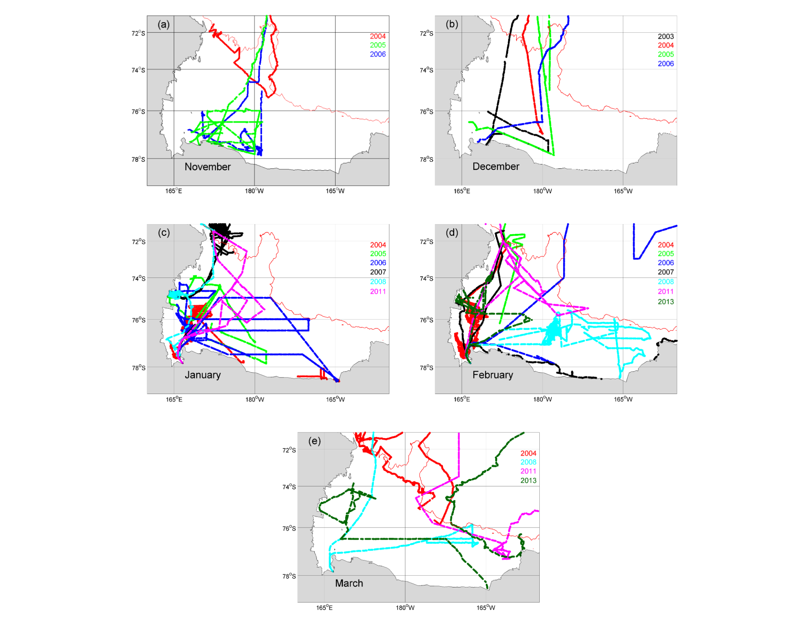
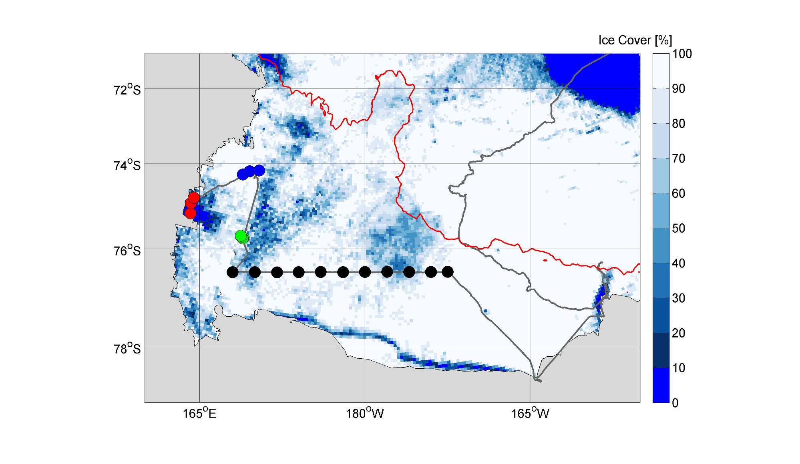
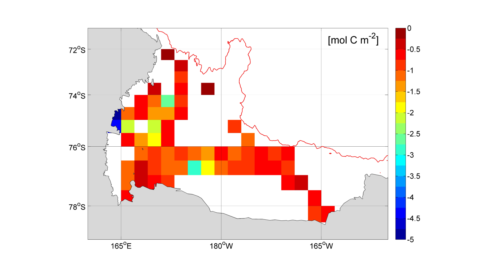
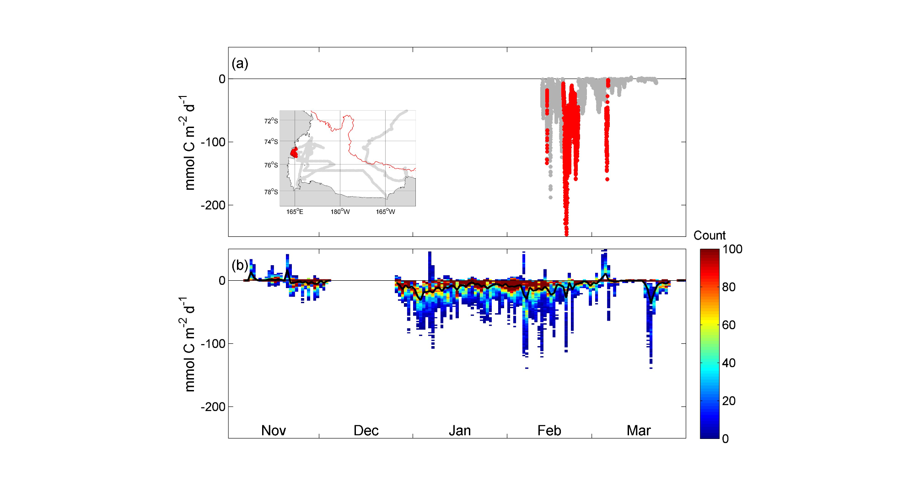
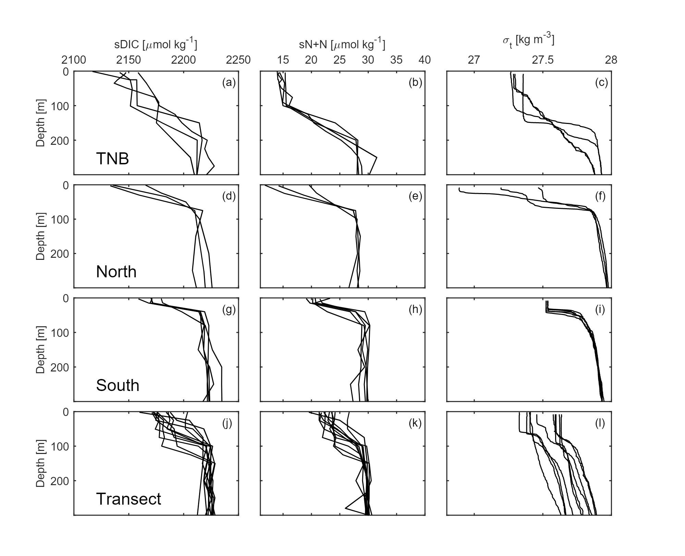
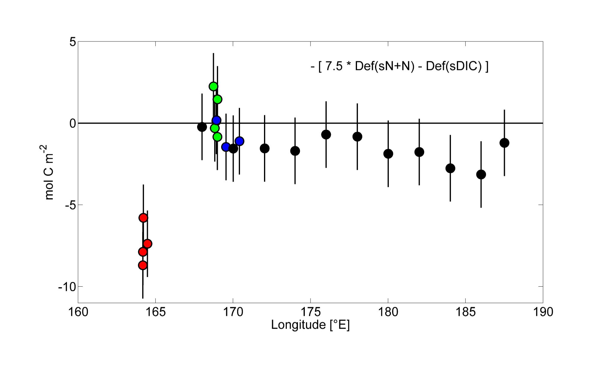

# Air-sea-CO2-exchange-publication-repository
Code from the publication: DeJong, Hans B., and Robert B. Dunbar. "Air‐sea CO2 exchange in the Ross Sea, Antarctica." Journal of Geophysical Research: Oceans 122.10 (2017): 8167-8181. (https://agupubs.onlinelibrary.wiley.com/doi/full/10.1002/2017JC012853)

## Figures

## Calculating CO2 Flux rates (code/co2-flux-rates)

### wind_unpack.m, wind_merge_files.m, ncar_call_number_extract.m, ncar_extract.m, julian_multiplied_4.m
We obtained in situ pCO2, SST, and salinity underway measurements from the Lamont Doherty Earth Observatory (LDEO) pCO2 database (Takahashi et al., 2009) and continuous shipboard wind speed data (binned by minute) from the Marine Geoscience Data System
(MGDS, http://www.marine-geo.org). All measurements were made on the R/V Nathaniel B. Palmer (NBP). We included data from 20 cruises in the Ross Sea region (160°E – 155°W, 71°S – 79°S) with concurrent pCO2, SST, salinity, and wind speed measurements (n = 135,772).The shipboard wind speed data, measured at around 25 m height, were corrected for ship motion and adjusted to 10 m height by a factor of 0.91 following Thomas et al. (2005). 

### calculate_fco2.m, co2flux14.m, and fco2_merge_files.m

The following equation was used to calculate instantaneous air-sea CO2 flux without the presence of sea ice:

where k is the CO2 gas transfer velocity (cm h-1), K0 is the solubility of CO2 in seawater (mol L-1 atm-1), and pCO2 and pCO2atm are the partial pressures of CO2 in the surface water and overlying air, respectively. The solubility term (K0) is a function of temperature and salinity (Weiss, 1974). We estimated pCO2atm from the CO2 concentrations at the South Pole, which are identical to atmospheric CO2 concentrations at Palmer Station on the Antarctic Peninsula (GLOBALVIEW-CO2, 2013).  By convention, a negative flux denotes a downward CO2 flux into the ocean. Here we use the term "greater" to refer to a more negative flux.

CO2 fluxes are sensitive to the gas transfer velocity (k) parameterization, especially at higher wind speeds. Using eddy covariance, a recent study by Butterworth and Miller (2016) quadrupled the number of direct CO2 flux measurements from the Southern Ocean. Their study includes many direct CO2 flux measurements from the Ross Sea. After testing various gas transfer velocity parameterizations, they found that the quadratic parameterizations of Wanninkhof (2014) most accurately modeled their direct CO2 flux measurements, especially at higher wind speeds. Therefore, we calculated k following Wanninkhof (2014):

where U10 is the wind speed at 10 m height and Sc is the temperature dependent Schmidt number Wanninkhof (2014). Butterworth and Miller (2016) also made the first direct CO2 flux measurements in the Antarctic marginal ice zone over a range of sea ice conditions. They confirmed that CO2 flux decreased in proportion to the fraction of sea ice cover. Hence, we calculated instantaneous CO2 flux in the presence of ice as

CO2 flux = CO2 flux (no ice) X (1 - A)

where A is the sea ice concentration. 

### sea_ice_call_number_extract.m and sea_ice_extract.m

We used daily satellite derived 6.25 km resolution AMSR-E and AMSR-2 sea ice concentration data from the University of Bremen (Spreen et al., 2008). 

## Spatial Distribution of CO2 fluxes (code/co2-flux-grid-cells)

### grid_fco2.m, add_fluxes.m, grid_ice.m, grid_pco2.m, grid_wind_NCEP.m, grid_wind_ship.m
To evaluate the spatial distribution of CO2 fluxes, we binned the instantaneous CO2 flux data into 0.5° latitude by 2° longitude grid cells. We averaged the CO2 flux for each grid cell by month (November–March). To reduce biases by an overrepresented day and/or year, we first averaged all values within each space/month grid cell by day, then year, and then averaged all years together. To estimate monthly CO2 fluxes for the Ross Sea continental shelf (November–March), we averaged all grid cells poleward of the 1,000 m isopleth. Cumulative CO2 fluxes from November through March approximate the annual flux since ~95% of the Ross Sea continental shelf is covered in sea ice during the winter (Arrigo & van Dijken, 2003b).

## Uncertainties in Calculating CO2 Flux Rates (code/co2-flux-uncertainty)

### stdev_fco2.m, st_error_fco2.m, num_days_data.m
To estimate the sampling uncertainty of individual grid cells, we calculated the standard deviation (SD) of the daily CO2 flux rates for all space/month grid cells (with >1 day of data). We then calculated the standard error for all these space/month grid cells:

If a grid cell only had data from 1 day, the average standard deviation of all grid cells for that month was used as the standard error.

### error_simulations_fco2.m
We used the bootstrap method (Efron & Tibshirani, 1994) to estimate the sampling uncertainty of the monthly CO2 flux rates for the Ross Sea continental shelf. We accounted for both the sampling error within each grid cell as well as the sampling error from the limited spatial coverage of CO2 flux data. For each month, we randomly sampled N (number of grid cells with data for the month) grid cell values with replacement. Each grid cell value was sampled from a normal distribution based on the mean CO2 flux rate for that
grid cell and the associated standard error. These sampled grid cell values were then averaged to obtain the mean CO2 flux rate for that month for the Ross Sea continental shelf. We repeated this sampling procedure 10000 times and then calculated the standard deviation of the 10000 sampled means. This method was also used to calculate the uncertainty of the monthly mean estimates of pCO2, ship wind speed, NCEP wind speed, and ice cover.

## Calculating Annual CO2 Flux into Terra Nova Bay (code/co2-flux-TNB)

### calculate_fco2_aws.m, calculate_fco2_ncep.m, co2flux14.m, extract_ship_wind_TNB.m, netcdf_wind_TNB.m 
We modeled annual CO2 fluxes into TNB for the 2012/2013 season with 3-hourly wind data from an automatic weather station (AWS). The AWS Manuela (AMRC, SSEC, UWMadison) is located on Inexpressible Island at the base of Reeves Glacier along the western edge of TNB. During the TRACERS cruise, shipboard (binned 3-hourly) and AWS wind speed data (scaled by 0.76) tracked each other closely. Since
winds consistently blow from Reeves Glacier into TNB (Bromwich, 1989), we used scaled AWS Manuela data to represent 10 m height winds in TNB. We also calculated CO2 fluxes into TNB with 6-hourly NCEP/NCAR Reanalysis wind product data (Kalnay et al., 1996).

### sea_ice_compiler_TNB.m, netcdf_sst_TNB.m
For the air-to-sea CO2 flux calculations, we also used 3.125 km resolution AMSR-2 sea ice concentration data from the University of Bremen (Spreen et al., 2008) and weekly 1° x 1° NOAA Optimum Interpolation Sea Surface Temperature V2 (Reynolds et al., 2002). 

### pco2_TNB.m
To estimate the annual pCO2 cycle in TNB, we used the LDEO pCO2 database (1996-2013). There is pCO2 data in TNB only between 21 December and 6 March. We binned the pCO2 data from TNB by Julian date and fit a 2nd order polynomial function. By 6 March, pCO2 in TNB remained low at 231 µatm. DeJong et al. (2017) argue that late summer productivity by frazil ice algae prevents surface pCO2 in TNB from increasing. We assume that pCO2 in TNB remains at 230 µatm through the end of March since frazil ice algae was observed there through March (in true color satellite images). Following Sweeney (2003), we set pCO2 between May and November to 425 µatm. We assumed that pCO2 linearly declines between 1 November and 21 December and linearly increases between 31 March and 1 May (Figure S2).

